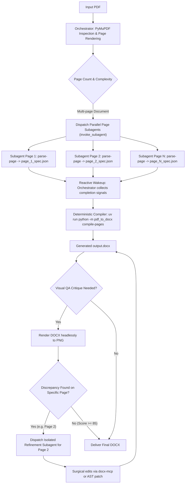

# PDF to DOCX Conversion Workflow Playbook

This playbook guides the agent on strategy selection, execution tradeoffs, subagent orchestration, and context conservation protocols.

---

## Strategy Comparison Matrix

| Strategy | Speed | Fidelity | Best Use Case | Risk / Limitations | Subagent Pattern |
| :--- | :--- | :--- | :--- | :--- | :--- |
| **Block-Based IR (Pydantic + python-docx)** | Medium (1-3s/page) | **Highest** | Analytical reports, tables, figures, charts, corporate styles | Requires structured extraction pass | 1 subagent per page outputs `page_{k}_spec.json` |
| **Fast-Track Markdown (docx-mcp)** | **Fastest** (<1s/page) | High for text | Articles, technical documentation, simple tabular layouts | Does not preserve custom chart vector styles or tight bounding box wraps | 1 subagent per page outputs `page_{k}.md` |
| **CodeAgent Sandbox Script** | Variable | Maximum flexibility | Unusual bespoke layouts, math formulas, complex multi-column grids | Script execution overhead | Dedicated sandbox subagent |

---

## Recommended Decision Tree & Subagent Orchestration



---

## Context Window Conservation Protocol

### Why Monolithic Processing Fails
In a monolithic run, an LLM attempting to convert a 5-page PDF sequentially will:
1. Ingest 5 high-resolution page images (~10,000–15,000 tokens each).
2. Generate verbose AST JSON representations with hundreds of nested spans, bounding boxes, and cells (~3,000–8,000 tokens per page).
3. Accumulate terminal execution logs, diff critiques, and intermediate tool responses.
4. Total tokens can rapidly exceed 100,000+ tokens within 4-5 pages, causing:
   - **Attention dilution**: The LLM forgets earlier formatting rules or drops table columns.
   - **Severe latency**: Massive prompts slow down every single subsequent tool invocation.
   - **Token ceiling crashes**: Hitting model context caps prematurely.

### The Subagent Solution: Strict Context Boundaries
By delegating each page to an independent subagent:
- **Parent Orchestrator Context**: Stays strictly constant $O(1)$! It only stores:
  - Document metadata (page count $N$, dimensions, orientation).
  - The `invoke_subagent` launch payload.
  - The concise 2-line completion summaries from each subagent.
- **Page Subagent Context**: Each subagent gets a pristine, dedicated 100% context budget:
  - Only inspects `orig_p{k}.png`.
  - Only generates and validates `page_{k}_spec.json`.
  - Terminates and frees its memory upon completion.
- **Fault Isolation**: If Page 3 encounters a parsing error or missing asset, only Subagent 3 is re-invoked. The orchestrator's history is never polluted with failed retries.

---

## Subagent Dispatch Contracts

### 1. Block-Based IR Subagent Prompt Template
```text
You are the isolated Page {k} Extractor subagent for document '{pdf_path}'.
Input page render: '{rendered_pages_dir}/orig_p{k}.png'.

Tasks:
1. Extract Page {k} layout into the canonical PageSpec JSON format:
   uv run python -m pdf_to_docx parse-page {pdf_path} --page {k} --image {rendered_pages_dir}/orig_p{k}.png -o .conversion_workspace/page_{k}_spec.json --assets-dir ./assets
2. Read the resulting JSON and verify:
   - All headings and paragraphs are preserved.
   - Tables contain correct column counts, headers, and cell values.
   - Figures/logos are properly cropped into './assets/'.
3. Respond to parent orchestrator with a concise 2-line summary:
   "Page {k} extraction complete: {num_blocks} blocks, {num_tables} tables, {num_charts} charts saved to .conversion_workspace/page_{k}_spec.json."
Do NOT output the raw JSON in your response to keep the parent context clean.
```

### 2. Fast-Track Markdown Subagent Prompt Template
```text
You are the isolated Page {k} Markdown Extractor subagent for document '{pdf_path}'.
Input page render: '{rendered_pages_dir}/orig_p{k}.png'.

Tasks:
1. Extract Page {k} into GitHub-Flavored Markdown:
   uv run python -m pdf_to_docx to-markdown-page {pdf_path} --page {k} --image {rendered_pages_dir}/orig_p{k}.png -o .conversion_workspace/page_{k}.md
2. Respond with a concise 1-line confirmation:
   "Page {k} markdown exported to .conversion_workspace/page_{k}.md."
```

---

## Best Practices & Anti-Patterns

### Anti-Patterns to Avoid
1. **Never perform multi-page layout extraction in the orchestrator thread**:
   - Always dispatch subagents for pages $1..N$.
2. **Never return raw JSON payloads from subagents to the parent agent**:
   - Subagents must write JSON directly to `.conversion_workspace/page_{k}_spec.json` and return only an executive confirmation.
3. **Never make dozens of linear MCP calls for basic layout construction**:
   - Calling `add_table`, `add_row`, `modify_cell`, `set_formatting` over 50 roundtrips is slow and fragile.
   - Instead, compile the full table or document atomically using `DocxCompiler` or `docx-mcp: create_from_markdown`.
4. **Never rely solely on text OCR**:
   - OCR loses font sizing, line spacing, table borders, and bounding boxes.
   - Always use Gemini Flash multimodal spatial parsing with PyMuPDF high-DPI rasterization.

### Critical OpenXML Formatting Rules
1. **Page Breaks within Table Rows**: Always ensure table rows have `<w:cantSplit/>` so that a row is not sliced in half across a page boundary.
2. **Multi-Page Tables**: Always set `<w:tblHeader/>` on row 0 so table headers automatically repeat when a table extends past page 1.
3. **Column Widths**: Calculate explicit column widths in twips (`1 inch = 1440 twips`) rather than relying on Word's auto-fit, which frequently shifts during cross-platform rendering.
