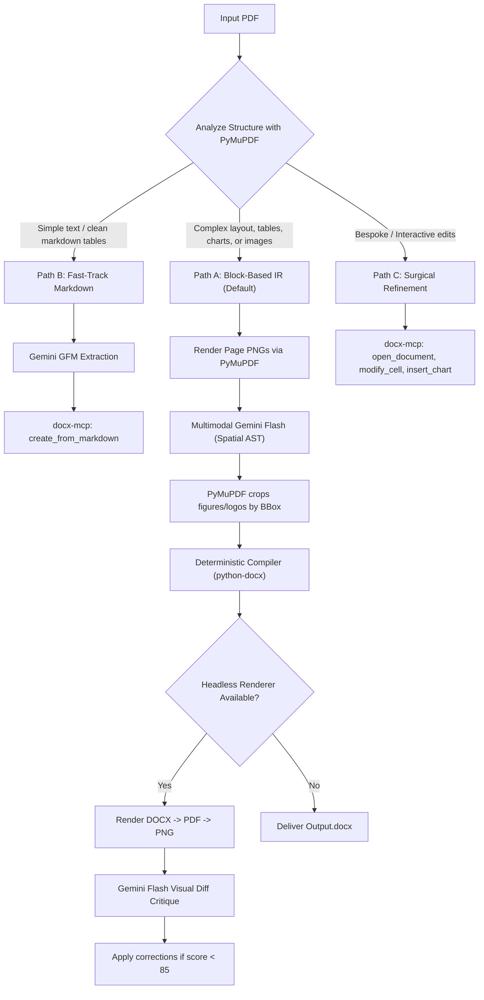

# PDF to DOCX Conversion Workflow Playbook

This playbook guides the agent on strategy selection, execution tradeoffs, and recovery protocols.

---

## Strategy Comparison Matrix

| Strategy | Speed | Fidelity | Best Use Case | Risk / Limitations |
| :--- | :--- | :--- | :--- | :--- |
| **Block-Based IR (Pydantic + python-docx)** | Medium (1-3s/page) | **Highest** | Analytical reports, tables, figures, charts, corporate styles | Requires structured extraction pass |
| **Fast-Track Markdown (docx-mcp)** | **Fastest** (<1s/page) | High for text | Articles, technical documentation, simple tabular layouts | Does not preserve custom chart vector styles or tight bounding box wraps |
| **CodeAgent Sandbox Script** | Variable | Maximum flexibility | Unusual bespoke layouts, math formulas, complex multi-column grids | Script execution overhead |

---

## Recommended Decision Tree

---

## Best Practices & Anti-Patterns

### Anti-Patterns to Avoid
1. **Never make dozens of linear MCP calls for basic layout construction**:
   - Calling `add_table`, `add_row`, `modify_cell`, `set_formatting` over 50 roundtrips is slow, fragile, and loses global context.
   - Instead, compile the full table or document atomically using `DocxCompiler` or `docx-mcp: create_from_markdown`.
2. **Never rely solely on text OCR**:
   - OCR loses font sizing, line spacing, table borders, and bounding boxes.
   - Always use Gemini Flash multimodal spatial parsing with PyMuPDF high-DPI rasterization.
3. **Never embed rasterized vector logos blindly**:
   - For logos, flowcharts, and diagrams, use PyMuPDF `extract_region` at 300 DPI to preserve crispness.

### Critical OpenXML Formatting Rules
1. **Page Breaks within Table Rows**: Always ensure table rows have `<w:cantSplit/>` so that a row is not sliced in half across a page boundary.
2. **Multi-Page Tables**: Always set `<w:tblHeader/>` on row 0 so table headers automatically repeat when a table extends past page 1.
3. **Column Widths**: Calculate explicit column widths in twips (`1 inch = 1440 twips`) rather than relying on Word's auto-fit, which frequently shifts during cross-platform rendering.
